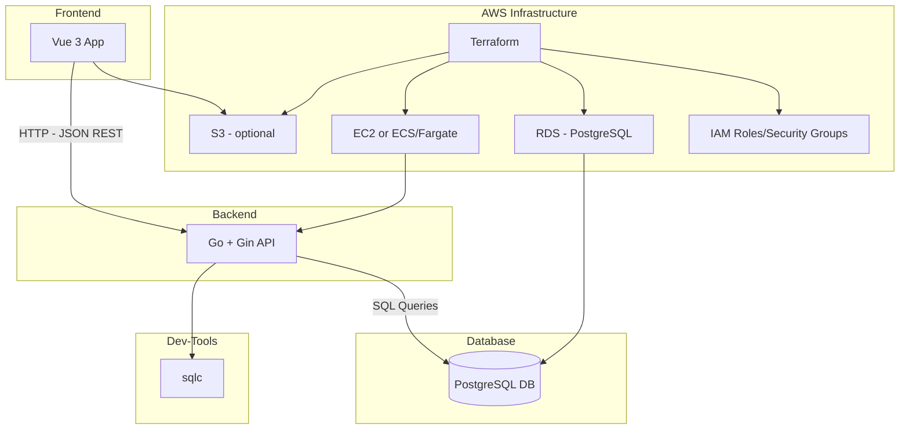

# Text-based Farming RPG

## Overview

This document outlines the technical design of a text-based farming RPG game designed for AWS deployment.  

The game allows users to manage their farms, plant and harvest crops, sell goods at the town market, and engage in other time-based activities.

---

## Goals & Non-Goals

### Goals

- Provide endpoints for account creation and login
- Provide endpoints for account management (e.g. password change, profile customizations)
- Provide endpoints for player inventory (view, add, destroy)
- Provide endpoints for farm management (e.g. buying plots, upgrades)
- Provide endpoints for planting and harvesting crops
- Provide endpoints for selling goods at the town market
- Secure API with JWT-based authentication
- Use PostgreSQL for persistent storage
- Implement simple web frontend interface for testing and interaction
- Setup Infrastructure as Code (IaC) and CI/CD for cloud deployment and rapid iteration

### Non-Goals

- Implement real-time chat or multi-player features
- Integrate payment services for microtransactions
- Enable direct player-to-player interactions or trading
- Add extended features such as animals, orchards, brewing, or crafting systems
- Support mobile platforms or native desktop clients
- Implement MFA sign-in authentication via HOTP

---

## Architecture Overview

This project consists of four major components:
  
- A RESTful API backend written in Go
- A relational database for persistent storage
- A web frontend that interacts with the backend via JSON APIs
- Cloud infrastructure for deployment

### Backend

The backend API will be written in Go using the [Gin] framework for routing and middleware. SQL queries and type-safe data access will be handled via `sqlc`, which generates Go code from raw SQL queries. The API will expose RESTful endpoints for interacting with the game logic and persistent data.

### Database

[PostgreSQL] will serve as the primary relational database for storing user accounts, farms, inventories, market transactions, and time-based game events. Schema versioning will be managed via `migrate`, `goose`, or similar tooling (to be finalized).

### Frontend

The initial frontend will be a minimal [Vue3] application, primarily used for testing API endpoints and simulating player interaction.* Future iterations may enhance UI/UX or incorporate other frontend frameworks.  

**This UI is primarily for testing and admin convenience; It is not representative of a polished user experience.*

### AWS Infrastructure

Infrastructure will be defined and deployed using [Terraform] to ensure repeatability and version control. The architecture will initially consist of:

- An EC2 instance or container service (ECS/Fargate) to host the API
- RDS for PostgreSQL
- S3 for static asset hosting
- IAM roles and security groups for access control

### Architecture Diagram



---

## Data Models/Schema

### Tables Overview

#### Users

- Represents a user account.

```plaintext
users
- id (PK)
- username
- email
- password_hash
- created_at
```

#### Farms

- Represents a user's farm.

```plaintext
farms
- id (PK)
- user_id (FK to users)
- name
- created_at
```

#### Plots

- Represents a single tile of land on a user's farm.
- May contain a planted crop, or could be empty. Tracks soil type and crop state.

```plaintext
plots
- id (PK)
- farm_id (FK to farms)
- x
- y
- soil_type
- crop_id (FK to crops, nullable)
- planted_at
```

#### Crops

- Represents crops that can be planted on a plot.
- Contains information regarding crop growth time, yield, and planting season (if applicable).

```plaintext
crops
- id (PK)
- name
- growth_time
- yield_amount
- season
```

#### Items

- Represents items that can be in a player's inventory.
- Contains information about the item such as, the item's name, type, and any effects associated with the item.

```plaintext
items
- id (PK)
- name
- type (tool, seed, feed, etc.)
- effect_json
```

#### Inventory

- Represents items within a player's inventory.
- Contains information about the owner of the item, the item's id, and how many exist for the owner.

```plaintext
inventory
- id (PK)
- user_id (FK to users)
- item_id (FK to items)
- quantity
```

> Future Expansions: `quests`, `weather`, `npc`, `player_exchange`, etc.

### Provisional Tables

#### Animals

- Represents a single animal on a user's farm.
- Contains information about the animal's type, age, health, hunger, and last feeding time.

```plaintext
animals
- id (PK)
- farm_id (FK to farms)
- type
- age
- health
- hunger
- last_fed_at
```

---

## API/Interface Design

### Public

- `POST /api/v1/register`  
- `POST /api/v1/login`  

### Protected (JWT)

- `GET  /api/v1/farm`  
- `POST /api/v1/plot/plant`  
- `POST /api/v1/plot/harvest`  
- `POST /api/v1/animal/feed`  
- `GET  /api/v1/inventory`  
- `POST /api/v1/market/buy`  
- `POST /api/v1/market/sell`  

---

## Design Details

### Time-based Crop Growth

> *What is the tick/loop model? How are time-based events handled?*  

**TBD:** Leaning towards lazy-evaluation initially for simplicity, however the expectation is that this will eventually stop scaling well.  

### Inventory Transaction Handling

> *How is atomicity handled? How are inventory rollbacks handled? How are potential buy/sell race conditions handled?*  

### Data Access Patterns

> *Is RESTful CRUD sufficient, or should CQRS be explored as well?*  

---

## Gameplay & System Subsystems

### Game Logic Mechanics

> *How are crop growth stages modeled? Are crop timers checked lazily (on interaction), or actively via a job system?*  

### Background Jobs

> *Are tasks like crop maturation, animal hunger, or market restocks handled via background jobs, or lazy evaluation?*  
> *Will a job queue like `asynq`, `go-worker`, or a CRON loop be used?*  

### Admin & Moderation Tools

> *Are there endpoints for force-resetting a farm, banning users, or seeding initial data?*  

### Save/Load Systems

> *Does the backend store versioned snapshots of farm state for debugging or recovery?*  
> *How are breaking changes to the API or DB schema versioned to support seamless migration?*  

---

## Security & Performance

### Authentication/Authorization

> *What is the JWT expiration and refresh strategy? 15m access, 7d refresh?*  
> *How will passwords be stored securely, and not in plaintext? Argon2 or bcrypt?*  

### Data validation/sanitization

> *How is SQL Injection prevented? Prepared `sqlc` statements*  

### Performance Expectations or Bottlenecks

> *Where are the most likely places in the stack that may present bottlenecks?*  
> *Will any measures be in place to quickly identify and handle bottlenecks or performance issues when they show up?*  
> *How will load-testing be performed to identify performance or bottlenecks before they are deployed to the production environment?*  

### Rate Limits

> *How is rate limiting implemented to prevent against DDOS or Brute Force attacks?*  
> *Token bucket or leaky bucket? How will the chosen method be implemented?*  

### Caching

> *Does caching need to be implemented to offload database work, such as user farm data, inventory, or other frequently accessed data?*  
> *How will invalidation be handled for mutated data?*  

---

## Testing Plan

### Unit Tests

> *Which areas of the codebase will need fine-grained testing in isolation?*  
> *How will business logic be separated from infrastructure to enable testability?*  
> *What mocking strategy, if any, will be used for dependencies(i.e. database) and external services?*  

### Integration Tests

> *Which endpoints or workflows need end-to-end validation across multiple layers (API, DB, Auth)?*  
> *How will isolated environments, such as a test database, be managed?*  
> *Which critical game flows should always be covered by integration tests?*  
> *Will integration testing be ran via CI/CD, or only locally?*  

### Testing Tools/Frameworks

> *Which testing libraries and tools will be used for Go (e.g. `testing`, `testify`, `httptest`)?*  
> *Will any frontend testing frameworks be used for the frontend Vue app?*  
> *How will database test fixtures or migrations be managed during tests?*  

---

## Deployment & Operations

### Environments

- `dev`
- `staging`
- `prod`

### Deployment Process

> *What is the CI/CD plan?*  
> *What is the rollback plan? Container version pinning, DB schema backup/restore approach, etc.*  
> *How will the secure storage of environment variables be implemented? SSM Parameter store in `prod`, `.env` file in `dev`?*  

### Logging, Monitoring, and Error Tracking

> *What logging library will be used?*  
> *Where will logs go? Cloudwatch Logs? S3 archival?*  
> *What is the strategy for panic-recovery and stack tracing logs in production?*  
> *Will metrics/alerts be used, such as Prometheus, CloudWatch Alarms, Grafana?*  

### Rollback and Recovery Plans

> *In the event of a deployment failure or other catastrophy, what is the rollback and recovery plan?*  

### Dev Tooling  

- Local development via Docker Compose
- `sqlc` for generating type-safe Go code from prepared SQL statements for data access
- API auto-documentation via Swagger (TBD?)
- Git hooks for linting and test checks

---

## Risks & Mitigations

> *How will time-based server events be prevented from creating excessive server load? batching or lazy evaluation?*  
> *How will race conditions in planting/harvesting be prevented? db locking or row-versioning?*  
> *How will data corruption from early deployments be mitigated? migration versioning?*  
> *How will vendor lock-in be avoided? Use docker for local testing and off-cloud deployments?*  

---

## Scalability & Future Considerations

> *What changes would be required to support 100x more users?*  
> *Could the game support seasonal resets or competitions?*  
> *Would eventual consistency be acceptable in some systems (e.g. market pricing)?*  

---
