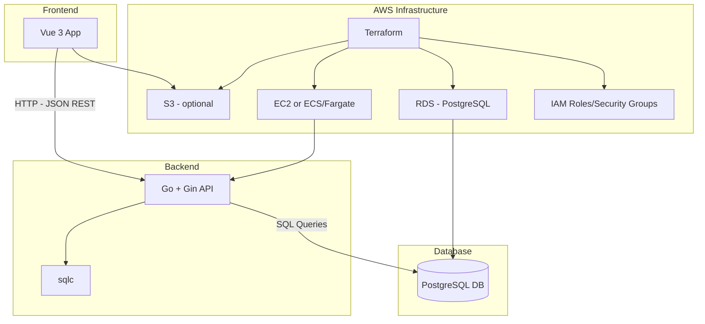

# Text-based Farming RPG

## Overview

This document outlines the technical design of a text-based farming RPG game designed for AWS deployment.  

The game allows users to manage their farms, plant and harvest crops, sell goods at the town market, and engage in other time-based activities.

---

## Goals & Non-Goals

### Goals

- Provide endpoints for account creation and login
- Provide endpoints for account management (e.g. password change, profile customizations)
- Provide endpoints for player inventory (view, add, destroy)
- Provide endpoints for farm management (e.g. buying plots, upgrades)
- Provide endpoints for planting and harvesting crops
- Provide endpoints for selling goods at the town market
- Secure API with JWT-based authentication
- Use PostgreSQL for persistent storage
- Implement simple web frontend interface for testing and interaction
- Setup Infrastructure as Code (IaC) and CI/CD for cloud deployment and rapid iteration

### Non-Goals

- Implement real-time chat or multi-player features
- Integrate payment services for microtransactions
- Enable direct player-to-player interactions or trading
- Add extended features such as animals, orchards, brewing, or crafting systems
- Support mobile platforms or native desktop clients
- Implement MFA sign-in authentication via HOTP

---

## Architecture Overview

This project consists of four major components:
  
- A RESTful API backend written in Go
- A relational database for persistent storage
- A web frontend that interacts with the backend via JSON APIs
- Cloud infrastructure for deployment

### Backend

The backend API will be written in Go using the [Gin] framework for routing and middleware. SQL queries and type-safe data access will be handled via sqlc, which generates Go code from raw SQL queries. The API will expose RESTful endpoints for interacting with the game logic and persistent data.

### Database

[PostgreSQL] will serve as the primary relational database for storing user accounts, farms, inventories, market transactions, and time-based game events. Schema versioning will be managed via `migrate`, `goose`, or similar tooling (to be finalized).

### Frontend

The initial frontend will be a minimal [Vue3] application, primarily used for testing API endpoints and simulating player interaction. Future iterations may enhance UI/UX or incorporate other frontend frameworks.

### AWS Infrastructure

Infrastructure will be defined and deployed using [Terraform] to ensure repeatibility and version control. The architecture will initially consist of:

- An EC2 instance or container service (ECS/Fargate) to host the API
- RDS for PostgreSQL
- S3 for static asset hosting
- IAM roles and security groups for access control

### Architecture Diagram



---

## Data Models/Schema

### Tables Overview

```plaintext
users
- id (PK)
- username
- email
- password_hash
- created_at

farms
- id (PK)
- user_id (FK to users)
- name
- created_at

plots
- id (PK)
- farm_id (FK to farms)
- x
- y
- soil_type
- crop_id (FK to crops, nullable)
- planted_at

crops
- id (PK)
- name
- growth_time
- yield_amount
- season

animals
- id (PK)
- farm_id (FK to farms)
- type
- age
- health
- hunger
- last_fed_at

items
- id (PK)
- name
- type (tool, seed, feed, etc.)
- effect_json

inventory
- id (PK)
- user_id (FK to users)
- item_id (FK to items)
- quantity

```

> Future Expansions: `quests`, `weather`, `npc`, `player_exchange`, etc.

---

## API/Interface Design

### Public

- `POST /api/v1/register`  
- `POST /api/v1/login`  

### Protected (JWT)

- `GET  /api/v1/farm`  
- `POST /api/v1/plot/plant`  
- `POST /api/v1/plot/harvest`  
- `POST /api/v1/animal/feed`  
- `GET  /api/v1/inventory`  
- `POST /api/v1/market/buy`  
- `POST /api/v1/market/sell`  

---

## Design Details

---

## Security & Performance

---

## Testing Plan

---

## Deployment & Operations

---

## Risks & Mitigations

---

## Appendix/References

---
